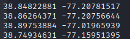
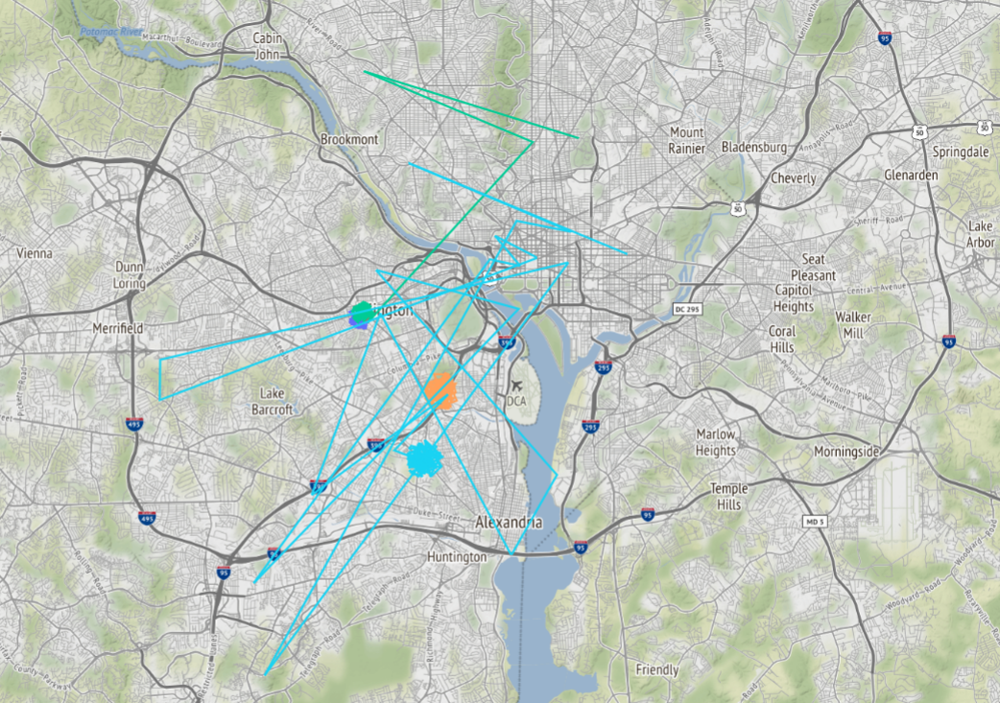
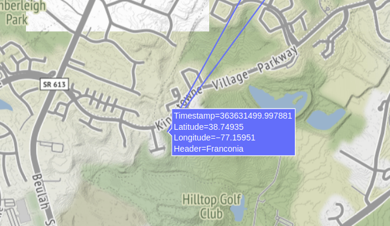
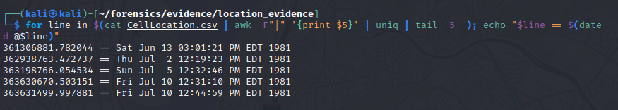
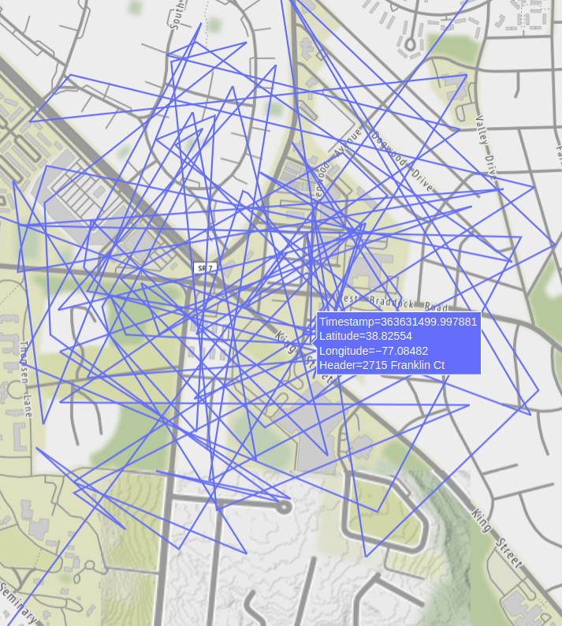

# 2012 National Art Gallery Scenerio 

# Extract Coordinates from Cell_Location.csv

### Get Coordinate Data from Csv 
	cat CellLocation.csv | awk -f "|" '{print $6, $7}' | uniq 
	

### Decode 'Mac Time'
	date -d @1339535604
	> Tue Jun 12 05:25:04 PM EDT 2012 
	

#### Extracting Time data from all files: 
	for line in $(find -type f); cat $line | echo -e "File is \n\n $line" && grep -i times
	
	
# Create a Plotly Geographical Chart in Python 

	import pandas as pd  

	if __name__ == "__main__":  
		us_cities = pd.read_csv("/home/kali/forensics/evidence/location_evidence/WifiLocation.csv", delimiter="|")  

		import plotly.express as px  

		fig = px.line_mapbox(us_cities, lat="Latitude", lon="Longitude", color="Timestamp", hover_data=[], zoom=3, height=900)  

		fig.update_layout(mapbox_style="stamen-terrain", mapbox_zoom=4, mapbox_center_lat=41,  
	 margin={"r": 0, "t": 0, "l": 0, "b": 0})  

		fig.show()

### Notice the area is Kingstown, Possible Location of alias "King"

--------------------

 Also Note, Header Information is not present in the Original CSV data, only the coordinates, and if you were to try to get more information, you would need to copy and paste the coordinates every time and this can be disturbing, especially if you are in a cloud vm. 

## Extracting more times from CSV location & Converting to Mac Time 
	for line in $(cat CellLocation.csv) | awk -F "|" '{print $5}' | uniq | tail -5 ); echo "$line == $(date -d @$line)"
	

# Creating Selenium Python Script to Extract the Local Address of Coordinate Locations 

let that render.

### What This Script is Doing: 
1. Inputs locations into Google Maps and attempts to extract an address from the coordinates
2. If the location does not coorelate to an exact location, The program will back grab a general area name for quicker and more relatable searches. 

These effects display on-hover: 

